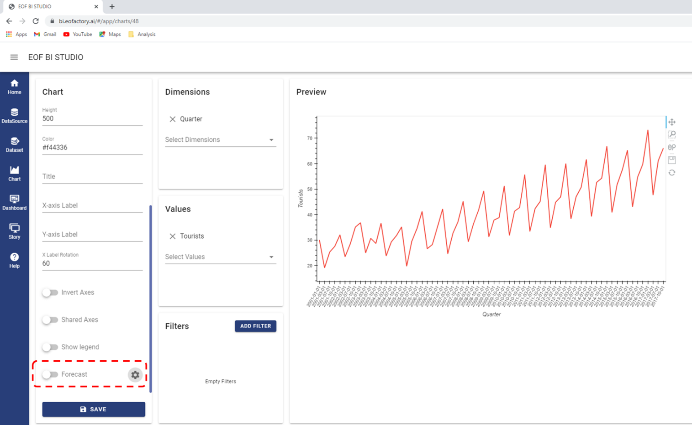
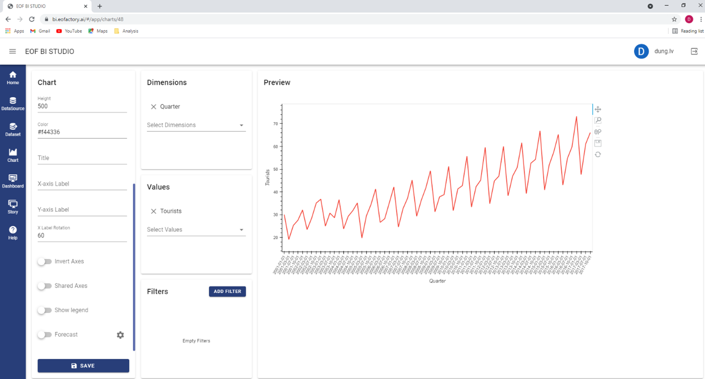
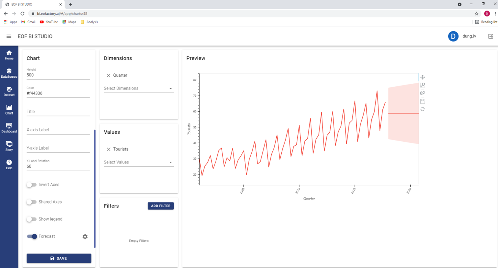
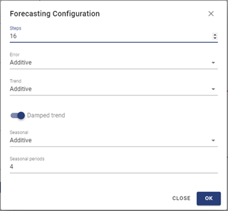
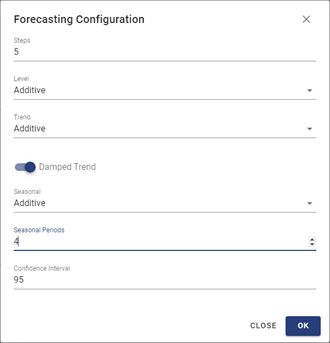
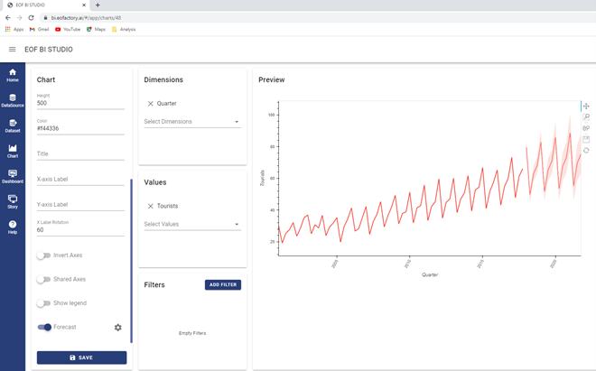

Forecasting
===========

Introduction
------------

The Forecasting function estimates forecasts of a time-series for future periods. The dataset must have at least a Time dimension. The foresting models are based on the exponential smoothing technique to find a regular pattern in measures that can be continued into the future.

The forecasting methods iteratively forecasts future values of a regular time series from weighted averages of past values of the series. The models take into account the level, trend and seasonal components. Level is the value of the time-series at each point of time. Trend is a tendency in the data to increase or decrease over time. Seasonality is a repeating, predictable variation in value, such as an annual fluctuation in temperature relative to the season.

Classification of exponential smoothing methods:

+--------------------+-----------------------+----------------------------------------------+
|   Level component  | Trend component       | Seasonal component                           |
|                    |                       +------------+--------------+------------------+
|                    |                       | N (none)   | A (additive) | M (multiplicate) |
+--------------------+-----------------------+------------+--------------+------------------+
| A (additive)       | N (none)              | (A,N,N)    | (A,N,A)      | (A,N,M)          |
|                    +-----------------------+------------+--------------+------------------+
|                    | A (additive)          | (A,A,N)    | (A,A,A)      | (A,A,M)          |
|                    +-----------------------+------------+--------------+------------------+
|                    | M (multiplicative)    | (A,M,N)    | (A,M,A)      | (A,M,M)          |
+--------------------+-----------------------+------------+--------------+------------------+
|M (multiplicative)  | N (none)              | (M,N,N)    | (M,N,A)      | (M,N,M)          |
|                    +-----------------------+------------+--------------+------------------+
|                    | A (additive)          | (M,A,N)    | (M,A,A)      | (M,A,M)          |
|                    +-----------------------+------------+--------------+------------------+
|                    | M (multiplicative)    | (M,M,N)    | (M,M,A)      | (M,M,M)          |
+--------------------+-----------------------+------------+--------------+------------------+

Some methods are known with the names below:

* (A,N,N): Simple exponential smoothing,
* (A,A,N): Holt’s linear method,
* (A,A,A): Additive Holt-Winters’ method,
* (A,A,M): Multiplicative Holt-Winters’ method.

For more information about the theory of forecasting, please navigate to `https://otexts.com/fpp3/expsmooth.html <https://otexts.com/fpp3/expsmooth.html>`_.

The forecasting function is integrated into a chart. When you create or open a chart, you can show the forecast on this chart by turning the Forecast checkbox on. You can change the forecast op-tions by clicking on the Setting |setting| button and accessing the Forecasting Configuration.

Showing Forecast
----------------

To show the forecast of a time-series, you must create a chart of this time-series first. Suppose that you have created a line chart as follow. The x axis presents the time dimension in quarters. The x axis presents the measure values aggregated by quarter.

Turn on the Forecast checkbox, then the chart displays the forecasted values succeeding the actu-al values.

There is a shaded area covering the forecasted line. This is the prediction interval presenting the confidence level of the forecast. The default confidence level is 95%, meaning that there is a 95% likelihood that the measure’s value will be within the prediction interval for the forecast period. You can change the confidence level in the Forecasting Configuration.

In  the above example, the forecasted line is a horizontal straight line. It is because the parame-ters set for the forecast do not take into account the trend and seasonal components. You can change these parameters by accessing the Forecasting Configuration.

Configuring Forecast
--------------------

Click the Setting |setting|  button beside the Forecast checkbox to access the Forecasting Configuration.

You can set the following parameters:

* Steps: setting the forecast length (in number of periods) that determines how far into the fu-ture the forecast extends, e.g., if the temporal granularity of the time series is quarter, a forecast length of 16 periods means that the forecast is done for 16 quarters (or 4 years).
* Level: selecting the smoothing equation for the level component, being Additive or Multiplica-tive.
* Trend: selecting the smoothing equation for the trend component, being None, Additive or Mul-tiplicative.
* Damped trend: specifying whether or not an included trend component is damped.
* Seasonal: selecting the smoothing equation for the seasonal component, being None, Additive or Multiplicative.
* Seasonal periods: specifying the number of periods in a complete seasonal cycle for seasonal models. For example, 4 for quarterly data with an annual cycle or 7 for daily data with a weekly cycle.
* Confidence level: specifying the likelihood that the measure’s value will be within the prediction interval in the forecast period.

The following graph is the result of forecasting on the same observed data but with parameters: 16-period forecast length, additive equation level, additive equation and damped trend, multiplica-tive equation seasonal, 4-period seasonality, and 95% confidence level.

