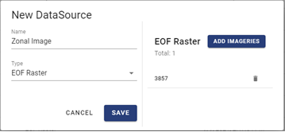
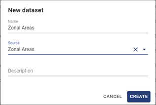
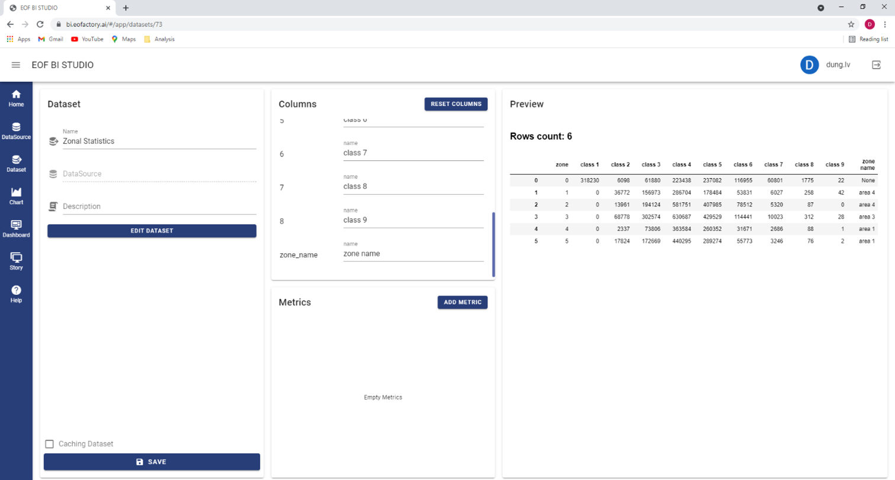

Zonal Statistics
================

This section will guide you to step-by-step realize a « zonal statistics as table » from inputs includ-ing a vector containing the zones and a raster containing values.

Creating Datasources
--------------------

Creating a datasource to get the raster
***************************************

In this example, we create an EOF Raster datasource and name it « Zonal Image ».

Click « Add Imageries » to get the raster.

Select workspace « eof-bi ».

Select the raster and click « Import Selected Imageries ». Then select the time range for the ras-ter.

Click « Import » to add the raster to the new datasource.

Click the « Save » button to complete the datasource creation.

Creating a datasource to get the vector
***************************************

In this example, we create an EOF Vector datasource and name it « Zonal Areas ».

Click « Add Vectors » to get the vector.

Select workspace « eof-bi ».

Select the zonal vector and click « Import Selected Vectors ». Then, the vector is added to the new datasource.

.. image:: ../images/advanced_analytics/create_datasource_9.png
    :align: center

Click the « Save » button to complete the datasource creation.

Creating Datasets
-----------------

Creating a dataset for the raster
*********************************

Create a new dataset and name it « Zonal Image ». Select datasource « Zonal Image ». 

Click « Create » to open the dataset’s detail screen. Name the first column as « red » and click « Save » to update the dataset.

Creating a dataset for the vector
*********************************

Create a new dataset and name it « Zonal Areas ». Select datasource « Zonal Areas ». 

Click « Create » to complete the dataset creation.

Creating a dataset for the statistics
*************************************

Create a new dataset and name it « Zonal Statistics ». Don’t select dataset. 

Click « Create » to open the dataset’s detail screen.

Click « Edit Dataset » to open the dataset’s edit tool. Now you can define the new dataset by fol-lowing the steps below:

-	Drag transformer « Zonal Cross Tabulate » and two datasets « Zonal Image » and « Zonal Areas » to the editing pane.
-	Connect column « red » of dataset « Zonal Image » and columns « geometry » and « name » of dataset « Zonal Areas » to the « Zonal Cross Tabulate » transformer’s inputs « value », « zone » and « zone_name », respectively.
-	Connect output « result » of the « Zonal Cross Tabulate » transformer to entry « result » of the « Output » box.

Click « Save Dataset » of the dataset editing tool. Then click « Save » in the dataset’s detail screen to update its results. The zonal statistics table is shown in the « Preview » pane as follow.

Rename the columns from « 0 », « 1 », « 2 »,… , « zone_name » to more descriptive names, e.g., « class 1 », « class 2 », « class 3 »,… , « zone name ». Click « Save » to update the dataset.

Now we create charts to view the results.

Creating Charts to View  Results
--------------------------------

Creating Chart to View the Value Raster
***************************************

Create a new One Band Layer chart, name it « Zonal Image » and select dataset « Zonal Image ».

Click « Create » to open the chart’s design screen.

In the « Values » pane, select column « red ». Then click « Save », the chart’s display updates to show the raster as follow.

Creating Chart to View the Area Vector
**************************************

Create a new Geometry chart, name it « Zonal Areas » and select dataset « Zonal Areas ».

Click « Create » to open the chart’s design screen.

In the « Values » pane, select column « geometry ». Click « Color Setting » and set « red » to the « Color Ramp » box (please refer Section 10 for more details of « Color Setting »).

In the chart design screen, update « Alpha » to 0.1 to specify the rate of transparency of the fill-ing color of the areas. Click « Save », chart’s display updates to show the areas as follows.

.. image:: ../images/advanced_analytics/create_chart_7.png
    :align: center

Creating Chart to View the Zonal Statistics Table
*************************************************

Create a new Table chart, name it « Zonal Statistics » and select dataset « Zonal Statistics ».

Click « Create » to open the chart’s design screen.

In the « Values » pane, select the columns you want to show in the table chart, e.g., « zone name », « class 1 », « class 2 », « class 3 », « class 4 » and « class 5 ». Click « Save », then the chart presents the results of zonal statistics as table.

Creating Dashboard to View the Zonal Statistics
-----------------------------------------------

Now we combine the created charts into a dashboard to visualize the inputs and output of the zon-al statistics.

Create a new dashboard and select the « Two Heroes » layout template. Name the dashboard « Zonal Statistics ».

Drag an Overlay component to the left empty cell.

Open the « Charts » pane. Drag the « Zonal Image » and « Zonal Areas » charts to the Overlay. You should add the « Zonal Areas » chart after the « Zonal Image » chart to ensure that the areas are placed on top of the raster.

Drag the « Zonal Statistics Table » chart to the remaining cell of the dashboard.

.. image:: ../images/advanced_analytics/create_dashboard_4.png
    :align: center

Run the dashboard to visualize the input raster and vector and the output statistics table.

.. image:: ../images/advanced_analytics/create_dashboard_5.png
    :align: center

