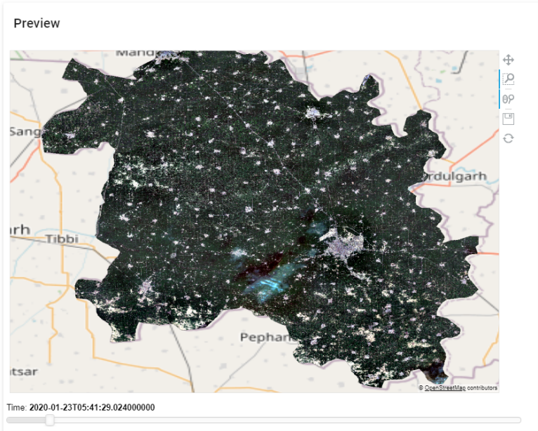
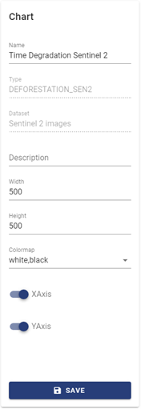

This function allows to create, design and manage analytic charts.
You can clicking the « Chart » menu to open the main screen of the Chart function. It allows to create new analytic charts and manage available ones.

Creating New Chart
===================

You can create a new chart by clicking the « New Chart » button. The « Chart » form opens:

    
Click the « Type » field, the following « Chart Types » opens allowing to select the type of chart:

.. image:: ../images/chart/create_chart_2.png
    :align: center

You can scroll the window to choose the type of chart you intend to create.

CREATING ONE BAND LAYER CHART
-----------------------------

CREATING ONE BAND TIME SERIES CHART
-----------------------------------

CREATING THREE BAND LAYER CHART
--------------------------------

This chart helps the user to monitor the deforestation of an area based on optical images.

Defining Dataset

Before creating the chart, you must specify the dataset for it. Click menu « Dataset » and create a new one.
Set a name to the dataset, e.g., « Sentinel 2 Images ». The dataset uses a datasource of type datacube (in this example, we uses datasource « Skymap ODC » created in Section 3.1.1).

In the dataset’s detail screen, select product « Sentinel_2_l2a » and the following AOI.

Set the column names: « blue », « green », « red » and « nir » in the « Column » pane:

Then, click the « Save » button to save the dataset. Its details are updated as follow:

We need to create another dataset to cache the results, which is necessary for the slope calcula-tion. Name the dataset, e.g., « Cached Sentinel 2 » and let « Source » field blank.

A blank dataset is created. Check « Caching dataset » (it is required to cache the result) and click button « Edit Dataset » to define the calculation.

In the « Edit Dataset » screen, drag the « Sentinel 2 Deforestation » transformer to the calculation canvas. It will calculate the slope result. For the input, drag the dataset we have created above to the canvas (in this example, its name is « Sentinel 2 Images »). Then, connect the « blue », « green », « red » and « nir » fields of the input dataset box to the corresponding entries of the transformer box. Connect also the « Result » of the transformer box to the « Result » of the out-put box. The calculation is defined as in the below figure:

Click « Save Dataset » to close the « Edit Dataset » screen. Click « Save » in the dataset screen. Then, you should wait a while until the caching icon on the top-right corner of the «  Dataset » pane changes color from red to blue. It means that the caching completes.

**Defining Chart**

Now you have enough condition to create the chart. Click the « Chart » menu and create a new one. Name the chart, e.g., « Time Degradation Sentinel 2 » and select type « Optical Deforesta-tion ».

In the « Setting » pane, assign the « Red », « Green », « Blue », « Nir » and « Slope » fields to the respective columns of the dataset.

Click « Save », the chart is displayed as follow:

.. image:: ../images/chart/optical_deforestation/create_optical_10.png
    :align: center

You can drag the « Time » slider to view the change of images in the left map. There are two modes of view: True Color and False Color. Radio buttons « True Color » and « False Color » allow you to turn between the modes.

The right map presents the image of NDVI slopes in the area.

When you click a point, on either the left map or the right map, the line graph presents the change of NDIV at the corresponding position. Indicator « Slope Coefficient » is the slope of this graph.

You can set the width and height of the chart, change color settings, show/hide the X and Y axis, and show the forecast of NDVI by selecting the corresponding buttons in the « Chart » pane.

More details about Color Settings and Forecasting are explained in Sections 8.2 and 9.

CREATING THREE BAND TIME SERIES CHART
-------------------------------------

Specify the chart’s name and type. In this case, you select « Three Band Time Series » as the type.
In the Dataset field, you select an available dataset. In the below example, you choose the « Sir-sa » dataset as created in Section 4.1, which uses a datasource of type Datacube and product «  sentinel_2_l2a ».

You can assign values to the Red, Green and Blue fields in the « Setting » pane by selecting re-spective bands, including: Red, Green, Blue, NIR.

Then, click the « Save » button to save the chart and update the « Preview » pane.

Sometimes the chart may load too long or cannot be displayed. The reason is you have created a too large dataset. In this case, you can go back to the « Dataset » screen and reduce the size by increasing the resolution.

After changing the resolution, you click the « Save » button to update the dataset. Now going back to the chart screen, you can see the chart displayed on the « Preview » pane.

You can zoom into any part of the map to view it in more details.

You can drag the « Time » slide to see the changes of the area in time:

CREATING RADAR DEFORESTATION CHART
----------------------------------

This chart helps the user to monitor the deforestation of an area based on radar images.

**Defining Dataset**

Before creating the chart, you must specify the dataset for it. Click menu « Dataset » and create a new one with the following details:

The dataset uses a datasource of type datacube (in this example, we uses datasource « Skymap ODC » created in Section 3.1.1). The product is « Sentinel1_GRD_gamma0_10m ». We select the following AOI.

**Define Chart**

Select menu « Chart » and click « New Chart ». In the « Chart » form, specify the chart’s name and select its type as « Radar Deforestation ». In the « Dataset » field, select the dataset created above.

In the « Setting » pane, you assign values to the vv and vh fields of the chart by selecting the re-spective bands (vv and vh) of the dataset.

You can set the width and height of the chart. You can also choose to show or hide the X axis and Y axis on the chart by turning on or off the « XAxis » and « YAxis » buttons respectively.

.. image:: ../images/chart/create_radar_4.png
    :align: center

Click the « Save » button to save the chart and update the result in the « Preview » pane:

You can adjust the first and the second points of time of the comparison by dragging sliders « Time 1 » and « Time 2 ». The chart’s image updates accordingly.

CREATING OPTICAL DEFORESTATION CHART
------------------------------------

Specify the chart’s name and type. In this case, you select « Optical Deforestation » as the type.

In the Dataset field, you select an available dataset. In the below example, you choose the a da-taset that uses a datasource of type Datacube and product « Sentinel_2_l2a ».

This chart uses the below dataset:

In this dataset, you need to create a metric named « ndiv ». Click the « Add Metric » button to open the tool of metric definition. Drag transformer « Normalized Difference » and fields « Red » and « NIR » to the canvas and connect them as in the following figure. After that, input « ndiv » to the « Name » textbox on the top-left conner of the screen and click the « Save Metric » button to save it.

Return to the « New Chart » form. You click the « Create » button to save the chart. It is then added to the list of available charts.

To design the chart, you click the « Design Chart » |design_chart| button on its row. The following form opens.

You can set the width and height of the chart. You can choose to show or hide X axis and Y axis on the chart by turning on or off the « XAxis » and « YAxis » buttons respectively.

You can select values for the chart by clicking on the « Select Values » drop-down list. On this type chart, you select value : indvi.

Click the « Save » button to save the chart design. Then the chart is displayed as follows. Click a position of the map, you can see the change of NDIV on the graph beside.

.. image:: ../images/chart/create_optical_6.png
    :align: center

CREATING TYLE MAP SERVICE CHART
-------------------------------

Specify the chart’s name and type. In this case, you select « Type Map Service Chart » as the type.

.. image:: ../images/chart/create_tyle_map_1.png
    :align: center

This chart uses a dataset having datasource of type EOF Raster (TMS) or Tile Map Service. (Please read Section 5 for the details of how to create a dataset)

* For dataset of an EOF Raster (TMS) datasource, you have to specify the name of dataset and the name of datasource, then the dataset is created as follow:

* For dataset of a Tile Map Service datasource, , you have to specify the name of dataset, the name of datasource and the service (which is the name of the tile map service you have specified when creating the datasource), then the dataset is created as follow:

On the the « New Chart » form, click the « Create » button to save the chart. Then the chart de-sign opens.

Select the value fields: url, bounds, minZoom, maxZoom and click the « Save » button, then the tile map service chart displays with the selected raster tiled on the base map.

CREATING WEB MAP SERVICE CHART
-------------------------------

CREATING GEOMETRY CHART
------------------------

CREATING BAR CHAR
------------------

CREATING LINE CHART
-------------------

CREATING PIE CHART
-------------------

CREATING TABLE CHART
--------------------

CREATING AREA CHART
--------------------

CREATING DISTRIBUTION CHART
----------------------------

CREATING SPREAD CHART
---------------------

CREATING HEATMAP CHART
-----------------------
