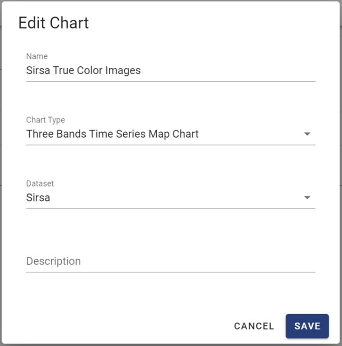

Editing Chart
=============

On the main screen of the Chart function, you can click the « Edit »  ?? button to edit a chart. The « Edit Chart » form allows to change the name, chart type and the dataset of the chart. Afer changing, you can click the « Save » button to save the chart.

