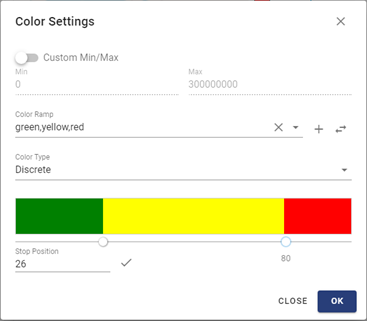
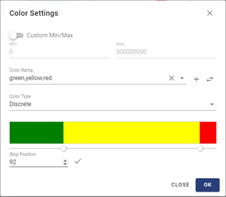

Color Setting for Geometry Chart
================================

Suppose that we want to make a map chart showing countries with population presented by col-ors. This section explains the steps to do it.

Creating Datasource
-------------------

Create a new datasource with name « Africa Geo Datasource » and type « EOF Vector ».

To specify the vector for the datasource, click button « EOF Vector ». Then select workspace « eof-bi ».

In the « eof-bi » workspace, select vector « africa » and click button « Import Selected Vectors ».

Then vector « africa » is added to the « New Datasource » form. Click button « Save » to save the datasource

Creating Dataset
----------------

Create a new dataset with name « Africa Geo Dataset » and type « Africa Geo Datasource ». Click button « Create » to save the new dataset.

Creating Chart
--------------

Create a new chart with name « Africa Population », type « Geometry Chart » and dataset « Africa Geo Dataset ».

Click button « Create » to save the new chart. The following screen opens allowing to design the chart.

Setting Color
-------------

Displaying Geometry Chart with Colors
*************************************

Select fields « geometry » and « pop_est » as values to be presented on the chart. Then, click button « Save » to save it. The chart displays the african countries with different colors represent-ing the value of field « pop_est » corresponding to each country.

The current colors are on a gray scale and you may want the chart to be more colorful. You can do it by clicking button « Color Settings »  . The default color setting form opens as follow:

In the form, you will define a range of color corresponding to a range of values of the selected field to show on the chart. For this example, the colors will be defined for the values of field « pop_est ».

Selecting Color Palette
***********************

You can set a green, yellow, red palette to the value by typing « green,yellow,red » in the « Color Ramp » textbox.

Click button « OK », then the colors of the chart change to the green, yellow, red palette accord-ingly.

You can also select one of the predefined palettes :

You can add more colors to the palette for this chart by clicking the « Add Color » |add| button beside the « Color Ramp » textbox.

Select a color and click button « OK » on the color picker form to add the color to the palette. You can add one or more colors before clicking button « close » to close the color picker. Then you get the palette as a list of colors separated by commas.

You can click button « Reverse Color » |reverse| to reverse the order of the colors in the list.

Click button « OK » in the « Color Setting » form and click button « Save » in the chart design screen to update the chart’s colors.

Setting the Min and Max Values Matched with the Color Range
***********************************************************

By default, the system matches the min and max of the color range with the min and max of the value in the dataset, respectively. For this example, the min and max values of « pop_est » are zero and 140,000,000 respectively.

In the case you don’t want to match the values with the whole color range, you can turn the « Custom Min/Max » checkbox on. Then you change values of Min and Max, for example, to 0 and 300,000,000 respectively.

For a better visualization, we should change the palette to « green,yellow,red ».

Click « OK » on the « Color Setting » form and save the chart, then its colors update accordingly. You can see that the colors of the chart are only in the lower half of the color range because we have selected 300,000,000 as the Max value, which is twice greater than the Max value of the field (being 140,000,000).

Continuous Colors or Discrete Colors
************************************

In the above examples, we use palettes of continuous colors, in which the colors change smoothly from the min value to the max value. We can also use palettes of discrete colors.

Open the « Color Setting » form, click the « Color Type » dropdown list and select « Discrete ». Then the color ruler’s display changes from continuous colors to discrete colors as follow.

Before clicking « OK », turn off checkbox « Custom Min/Max » to get a better visualization (be-cause when this checkbox is off, the colors are distributed to the whole value range of the field).

Save the chart to update its display, you see that there are only 3 colors on the map. In the dis-crete color mode, each color is assigned to a range of values of the data.

Adjusting the color range distribution
**************************************

By default, the value ranges are evenly distributed to the colors. You can manually adjust this dis-tribution in the « Color Setting » form. Slide the nodes that delimit the colors on the color ruler to change their value range. For example, in the below figure, we move the node delimiting green and yellow to the position of 26% and the node delimiting yellow and red to the position of 80% (the whole color ruler is 100% long).

Save the chart to update its display, we see that there are more yellow areas on the map because the range assigned to yellow has been extended.

On the the « Color Setting » form, you can also change the delimiters of colors by textbox « Stop Position ». Click to select a node that you want to move, input the new position to the textbox and click the |check| button. Then the color ranges change accordingly.

Note that the adjustment of the color delimiters is also applicable for the continuous color mode.

