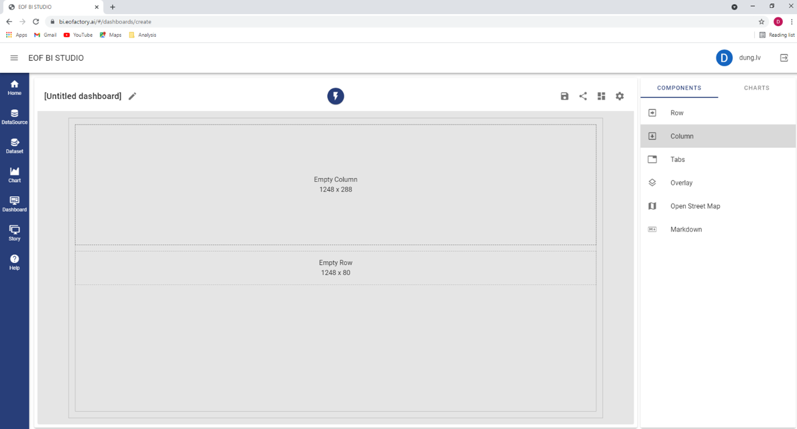

.. |delete| image:: ../icons/delete_element.png

This function allows to create and manage dashboards, which contain one or more charts to sup-port the analysis work in an interactive way.
Clicking on the « Dashboard » menu, you open the main screen of the Dashboard function.

Creating New Dashboard
======================

You can click the « New Dashboard » button to create a new one. The following form opens allow-ing to set the layout of the dashboard.

You can select a predefined template or a blank template to design the dashboard.

Selecting a Predefined Template
-------------------------------

If you select a predefined template, e.g., Hero and Five, the system creates for you an empty dashboard with the corresponding layout. The Hero and Five template gives a layout with a big cell in the top-left conner and five small cells on the right and bottom edges of the dashboard.
We need to design a layout to arrange the charts on the dashboard. Each chart can only be added to an available empty cell of the layout.

You can immediately add charts to the selected layout. You can also change this layout to fit your specific requirement by adding tabs, by removing/adding/changing rows and/or columns, etc. Read Section 7.1.2 for more details.

Selecting the Blank Template
----------------------------

If you select the Blank Template, the following form open to allow you design the dashboard. It contain an empty dashboard (on the left) and a list of components for adding to the dashboard (on the right).

There are different types of components to be added : Row, Column, Tabs, Overlay, Open Street Map, Markdown

To create a row, you drag the Row component to the dashboard. A row (with its automatic size, e.g., 1248x80) is added as follow:

.. image:: ../images/dashboard/blank_template_2.png
    :align: center 

You can change the size of the row by sliding its bottom edge. The size of the row changes ac-cordingly.
You can drag again the row component to the bottom edge of the existing one.

Then a new row with its automatic size is added.

To add a column to the first row, you drag a column component to the row. Then, a new column is created occupying all the available row’s area.

You can change the size of the new column by sliding its right edge. You can also change the size of the first row by sliding its bottom edge. Then the position of the second row change to keep its adjacency with the first one. The size of the column updates accordingly.

You can drag again a column component to the right edge of the existing column.

Then a new column is added, occupying all the remaining area of the container row.

You can drag a tab component to an empty cell.

Then a tab component is created occupying the area of the cell.

Click the « + » mark on the heading of the tab component to create a new tab. You can change the title of the tabs by typing directly on the title box. You can also delete an existing tab by click-ing the « x » mark on its title.

You can remove a tab component by clicking the Delete |delete| button in the top-right corner of the component. You can also remove a column or a row by clicking the Delete |delete| button on the top edge of the column or on the left edge of the row.

By this way, you can design the layout that fit your requirement.

Adding Charts
-------------

You can add charts to the dashboard. Click the « Charts » tab to see the available charts.

You can drag a chart into empty cell on the dashboard :

After dropping a chart, it is docked on an edge of the cell.

You can edit the dashboard’s title by clicking on the |edit| button beside the title textbox. You type a new title and click the |tick| button to save it.

You can change the size of the chart by dragging its bottom-right conner to a position that you want on the dashboard area. In the below example, we change the chart size to the whole dash-board area.

You can click the |delete| button on the upper-right conner of the chart to remove it from the dash-board.
Finally, you click the |save| button to save the dashboard.
