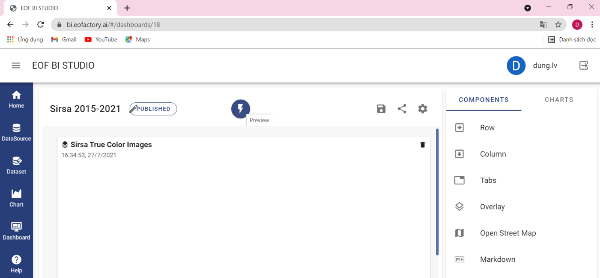
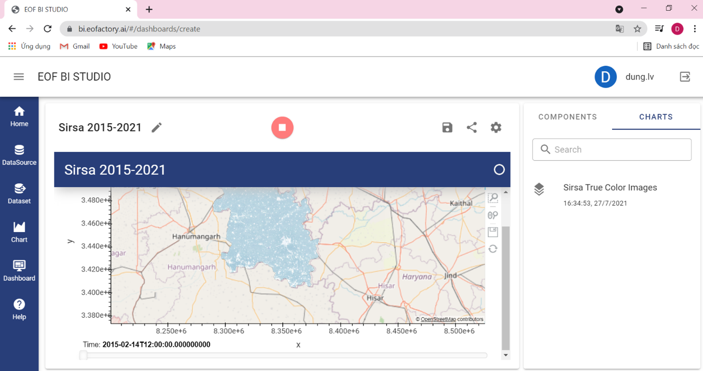

Running Dashboard
=================

On the Edit Dashboard form, you can run the dashboard by clicking on the  ?? button.

Then, the dashboard is loaded and run on your screen. The  ?? button changes to ??  button. To stop running, you click the  ?? button and the dashboard returns to the editing mode.

