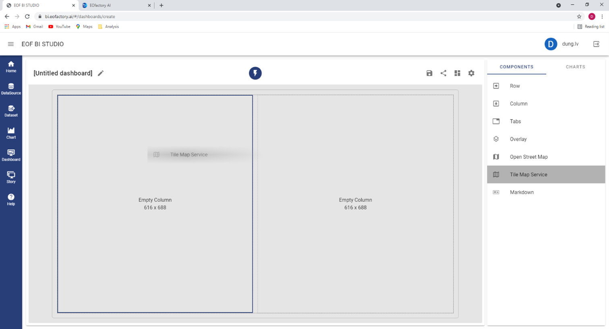
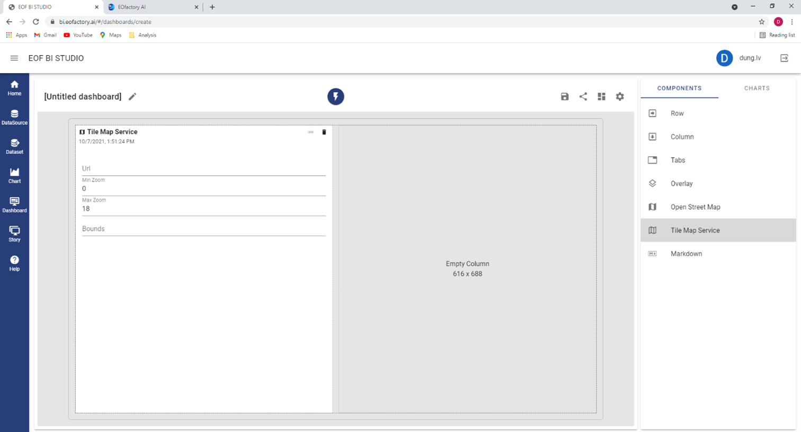
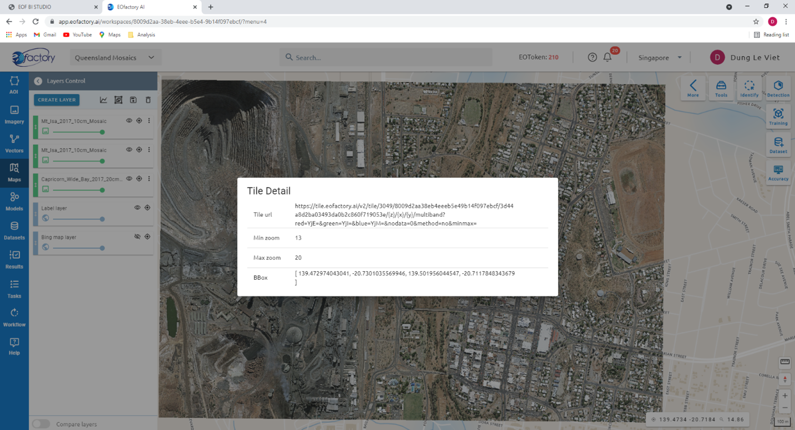
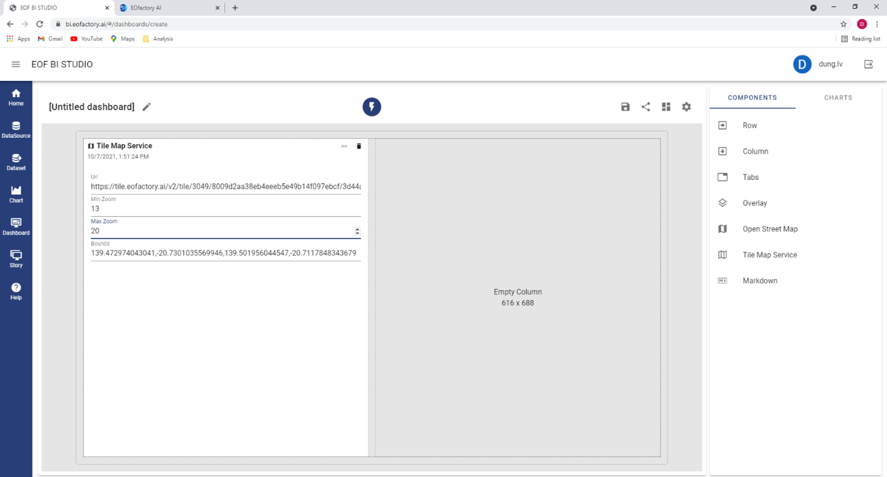
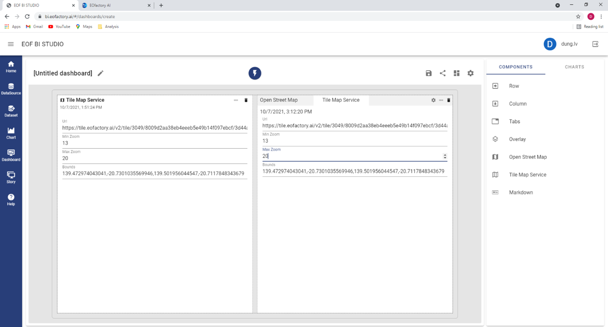
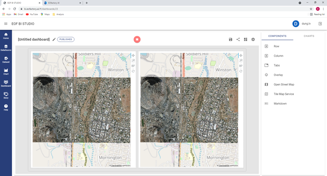

Using Tile Map Service component
================================

To add raster components to a dashboard, we can use tile map services instead of having to cre-ate charts before. Let’s take an example.

Create a new dashboard. You can select the « Two Heroes » template.  An empty dashboard is create. Drag a « Tile Map Service » component to an empty cell on the dashboard.

You have added an empty tile map service component to the dashboard.

We can get the details of a tile map service from an external system, e.g., by accessing Tile Detail of EOFactory’s images (please read Section 4.1.5 for more information).

Copy the value of the Tile url, Min zoom, Max zoom and BBox fields from EOFactory and paste them to the corresponding fields on the dashboard.

Next, we can drag an Overlay component to the other cell of the dashboard. Then, drag an Open Street Map component and Tile Map Service component on the Overlay. Fill in the new tile map service component the same values as the previous.

Run the dashboard, then we get the dashboard with the tile map components on it.

