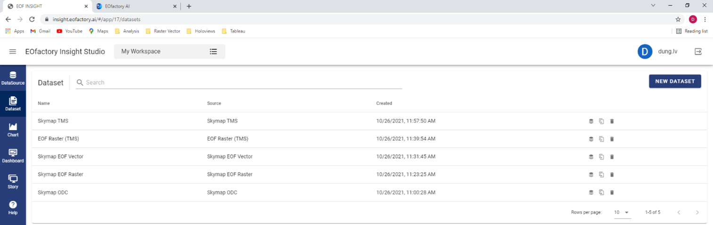
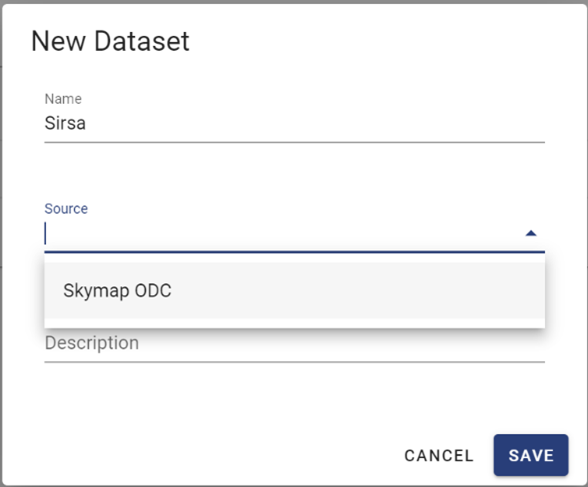
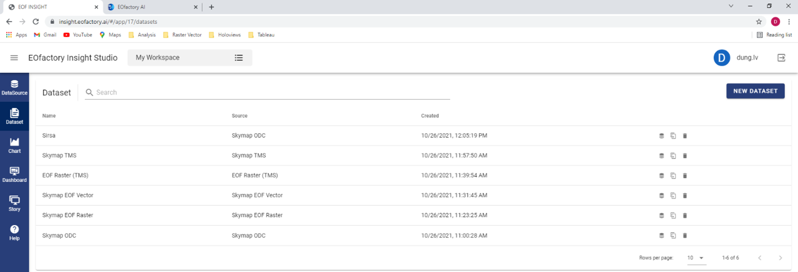

The Dataset function allows to create and manage datasets, which are basis for the analytics.

You can click the « Dataset » menu to open the main screen of Dataset function. It allows to cre-ate new datasets and manage available ones.

Creating New Dataset
====================

Click the « New Dataset » button on the Dataset page, the « New Dataset » form is opened allowing to create a new one. 
You needs to input the name and the source of the dataset. The source can be chosen from the available datasources.
By clicking on the « Save » button, you save the new dataset. It is then added the list of available datasets on the main screen of the « Dataset » function.

