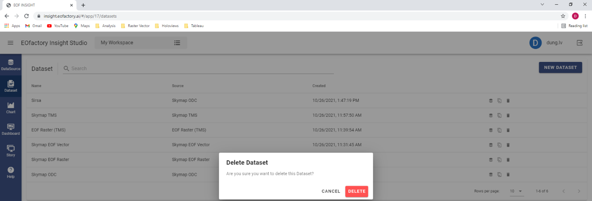

Deleting Dataset
================

To delete a dataset, you click the « Delete » |delete| button. A popup form opens to ask the confirma-tion. If you click the « Delete » button, the dataset is removed.

