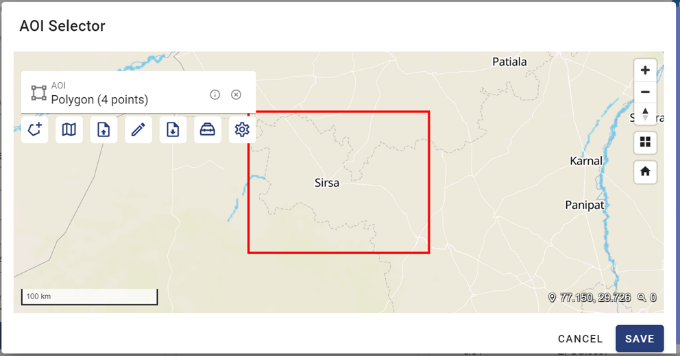

.. |darw_aoi| image:: ../icons/draw_aoi.png

Editing Dataset
===============

To update a dataset’s parameters, you can click the « Edit Dataset Property » |edit_dataset| button. The da-taset editing form opens allowing to make changes.

You can select one of the following products:

-	Deforestation_sentinel1_sigma0_50m
-	India_dsm_10
-	India_triplesat_1m
-	Landsat_7
-	Landsat_8
-	Landsat_8_thermal
-	Planet_4bands
-	PlanetScope_3B_Visual
-	S1_SLC_PolarimetricComposition_RGB_15m
-	Sen2_ard
-	Sentinel1_GRD_gamma0_10m
-	Sentinel1_GRD_gamma0_50m
-	Sentinel1_GRD_sigma0_10m
-	Sentinel1_GRD_sigma0_50m
-	Sentinel2_10m_mosaic
-	Sentinel2_l2a
-	Sirsa_sentinel_2_mosaic
-	UAV_10cm
-	Uav_sinarmas_2cm.

Selecting the resolution:

.. image:: ../images/dataset/edit_dataset_3.png
    :align: center

You select the area of interest (AOI) by specifying Longitude and Latitude: Click the |select| button to open the « API Selector » form.

On the AOI Selector, you have multiple ways to select an area:

-	Drawing an AOI : by clicking on the « Draw AOI » |draw_aoi| button.
-	Using Geocoding : by clicking on the « Geocoding » |geocoding| button.
-	Uploading an AOI file : by clicking on the « Uploading » |upload_aoi| button.

To draw an AOI, click the « Draw AOI » button. The drawing tools display, providing multiple ways to draw:
-	Draw rectangle, by clicking on the « Draw Rectangle » |draw_rectangle| button.
-	Draw polygon, by clicking on the « Draw Polygon » |draw_polygon|  button.
-	Draw buffered line, by clicking on the « Draw Buffered Line » |draw_line| button.
-	Draw buffered point, by clicking on the « Draw Buffered Point » |draw_point| button.

For example, by using « Draw Rectangle », you drag the mouse to specify a rectangle on the map. The area is dynamically changed in a dotted-line rectangle while dragging.

When drawing finishes, the AOI is fixed:

Once an AOI is selected, you can click the « Download AOI » |download_aoi| button to save it as a file in the local disk. On the downloading form, you can select one of the following formats: geojson, gpx, kml, shapefile, csv, gml, wkt.
In the example of the below screenshot, a file named « Sirsa.geojson » will be saved on the local disk.

When you have already an AOI file, e.g., a geojson file as in the above example, you can upload it to a dataset using the Upload AOI function. Click the « Upload AOI » |upload| button, a popup form ap-pears to invite upload.

You drag the file to be uploaded from the local folder and drop it on the popup form.

Then, the file’s name is set on the popup form:

You click the « Upload » button to set the AOI to the AOI Selector.

After the AOI is selected, click the « Save » button. Then, the coordinates of the AOI are set to the Longitude and Latitude fields of the dataset:

Now you also need to select the Start Date and End Date of the dataset. You can click each of these fields to open a Date form to make the selection.

After all the parameters are set, you can click the « Save » button to save the dataset.

