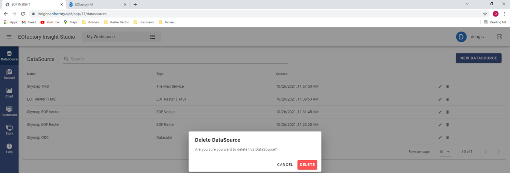

Deleting DataSource
===================
To delete a datasource, you can click the « Delete »   button. A popup form opens to ask the confirmation. If the you click the « Delete » button, the datasource is deleted.

