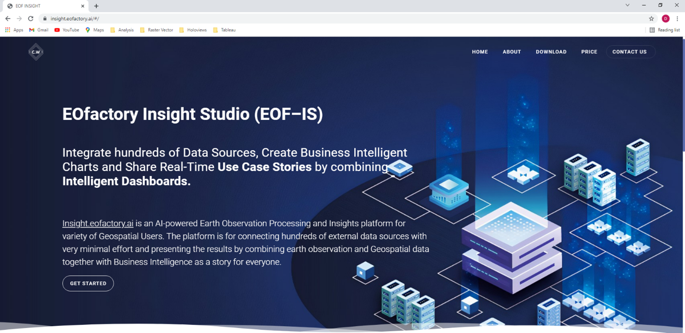
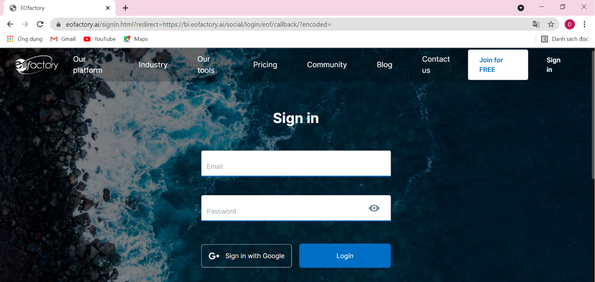
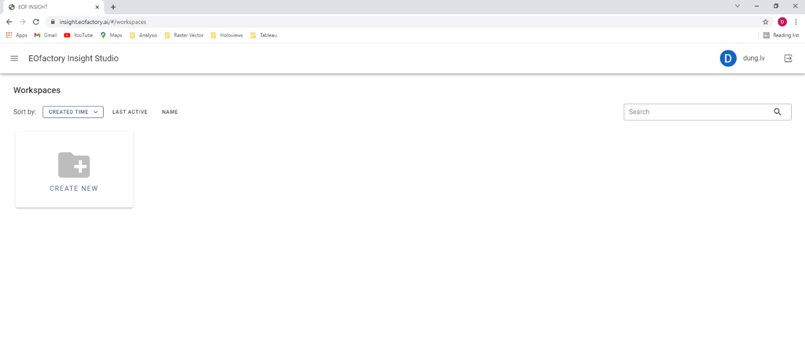
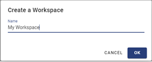
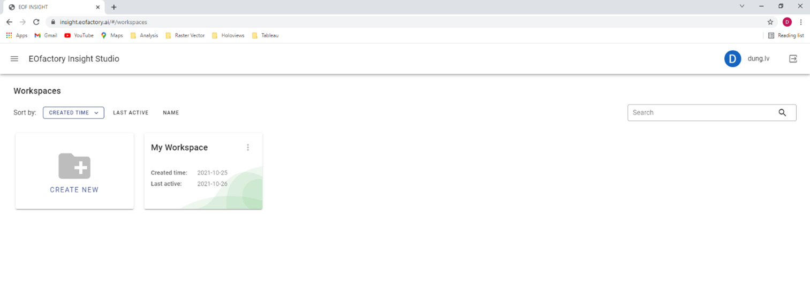
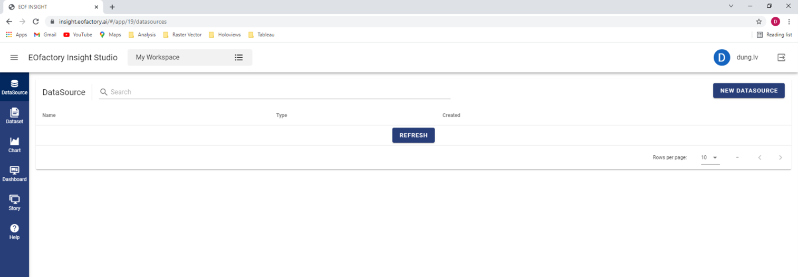

Starting the application
=========================
You connect to the application using the following address:

`https://insight.eofactory.ai <https://insight.eofactory.ai>`_

On the entry screen, click the « Get Started » button to log in the system. Input your email and password in the following login screen and push « Login ». You can also login by using « Sign in with Google », which uses your Google account to authenticate.

Working with workspaces
=======================
After you have successfully logged in, the application presents available workspaces you are per-mitted to work with.

-	Workspaces are spaces on the EOf Insight’s cloud provided to users for storing their work including datasets, charts, dashboards…
-	The user who creates a workspace is called the owner of the workspace.
-	The owner have all the rights on her workspace including viewing and editing.
-	A user having permission on a workspace can share it to other users and set permission for each one.

If it is the first time you access EOf Insight, no workspace is available. You can create a work-space by clicking « Create New » in the « Workspaces » screen.

The « Create a Workspaces » form opens. Input the name of the new workspace and click « OK ».

Then, your new workspace is created and displayed as a box on the screen.

You can access the workspace by clicking the box. The « Datasource » screen opens allowing you to start working with datasources.

Logging out
===========
Any time you want to exit the application, click the « Logout » |logout| button on the top-right corner. Then, the working session stops and makes you return to the entry screen.

